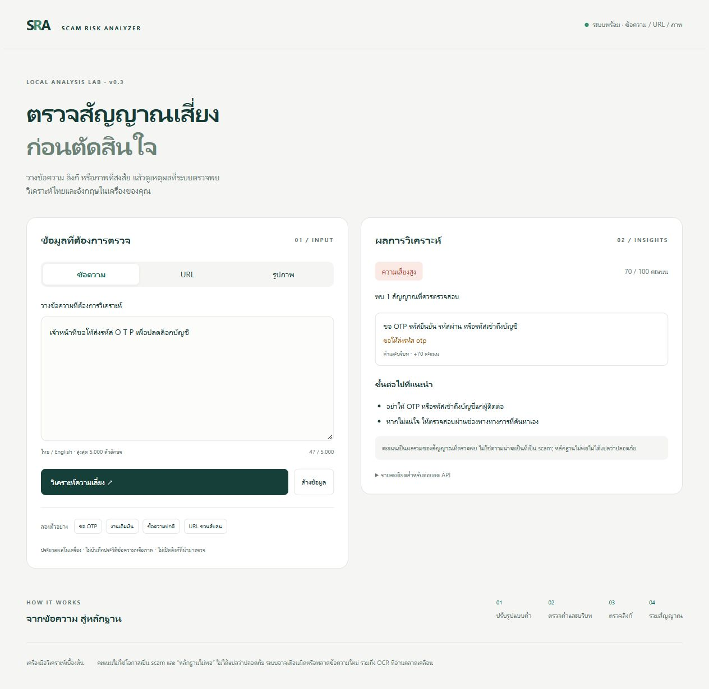
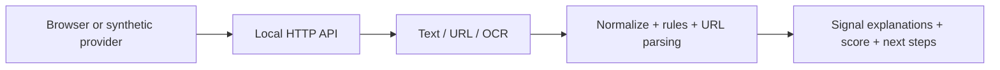

# Scam Risk Analyzer

**Explainable Thai/English risk triage for messages, URLs and screenshots.** A local portfolio MVP that shows *why* a message deserves review. The score is a heuristic sum of signals, not a probability or a verdict.



The [image-analysis screenshot](docs/demo-image.jpg) shows the OCR text beside its risk signals.

## Try it

Windows 10/11 with Python 3.12+:

1. Double-click `setup.cmd`. It creates a project-local virtual environment and installs pinned Python packages. For OCR it downloads Tesseract 5.5.3 and Thai/English language files into `.tools/`; local 7-Zip is required. If OCR setup fails, text and URL modes remain available.
2. Double-click `run.cmd` and open [http://127.0.0.1:5000/](http://127.0.0.1:5000/).
3. Pick a sample message, URL, or `tests/fixtures/thai.png`. Review the signal reasons and the OCR text.

Linux/macOS: create a Python 3.12+ venv, run `pip install -r requirements-lock.txt`, install Tesseract with `tha` and `eng` data using your OS package manager, then `python app.py`. The service binds to 127.0.0.1 only.

The source does **not** contain downloaded OCR binaries, the virtual environment, or personal submissions. Python packages are pinned in `requirements-lock.txt`; OCR installer/model hashes are checked by `scripts/setup_ocr.py`.

## What it analyzes

| Layer | Examples | Limits |
|---|---|---|
| Normalization | Unicode width/case, hidden characters, known O T P / p@ssw0rd variants | Narrow glossary, no arbitrary fuzzy search |
| Phrases and context | Requests for OTP/personal data, transfers, advance fees, task deposits, remote access, guaranteed returns | Bounded patterns can miss new wording |
| Negation | “ห้ามส่ง OTP”, “do not share” | Quoted/long-context advice may still be flagged |
| Static URLs | IP host, @ userinfo, shortener, punycode, long host | Never opens links or checks reputation |
| Combination | Threat + urgency, authority + transfer, remote access + account problem | Weights are heuristic |
| Image | Local Thai+English OCR then same text analyzer | OCR must be reviewed; unreadable images abstain |

No detected signal returns `insufficient_evidence` with no score. It never returns a “safe” verdict. The browser shows recommendations for checking an independent official channel.

## Architecture and tests



`app.py` handles validation and localhost serving; `analyzer.py` combines signals; `rules.py` holds versioned indicators; `normalization.py`, `url_analysis.py`, and `ocr.py` isolate the layers. `scripts/provider_simulator.py` shows how a provider could call the API without claiming an actual integration. [API contract](docs/API_CONTRACT.md) and [research mapping](docs/RESEARCH.md) document extension points.

From the project directory, run:

```powershell
.\.venv\Scripts\python.exe -m unittest discover -s tests -v
.\.venv\Scripts\python.exe scripts\provider_simulator.py --stress 100
.\.venv\Scripts\python.exe scripts\evaluate.py
.\.venv\Scripts\python.exe scripts\benchmark.py
```

The 36 synthetic evaluation cases currently produce **16 true alerts, 13 non-alerts, 3 false alerts and 4 missed alerts** at MEDIUM/HIGH threshold. The numbers are from a single-author exploratory set that informed two fixes; they cannot be generalized. The exact outcome list is in [evaluation results](docs/evaluation-results.json) and the earlier run in [baseline results](docs/evaluation-baseline.json). [Benchmark results](docs/benchmark-results.json) compare identical rule output over 1,058 synthetic texts (zero mismatches) and show local latency; they exclude OCR and HTTP.

## Responsible scope

This is a **local demonstration and starting point**, not a live protection system. It cannot intercept SMS/calls, authenticate a bank, prove a URL is malicious, or guarantee that an unflagged message is safe. No submissions are stored by the service and no URL is fetched. Browser history and an explicit JSON download are under the user's control. See [portfolio briefing](docs/PORTFOLIO.md) for design choices, known failures, roadmap, contribution disclosure and skills to learn. The demo walkthrough is [here](docs/TRY_IT.md).
