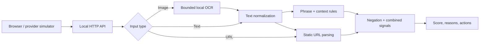

# Portfolio briefing

**Problem.** Suspicious Thai/English messages arrive through many channels. A binary answer hides reasons and can be misleading when evidence is sparse.

**MVP.** Scam Risk Analyzer is a local risk triage service. It accepts pasted text, a URL, or a PNG/JPEG screenshot. It returns a tier, signal IDs, reasons and suggested actions. When no supported signal appears, it abstains with “insufficient evidence.” A provider simulator exercises the same HTTP API without claiming any bank or phone integration.

**Engineering choices.** A small, deterministic rule engine avoids a large runtime model. Regexes are compiled once, gaps are bounded, normalization is once per message, and each rule scores once. Image processing has byte, pixel, concurrency and time limits. Links are never opened. Long numeric strings and email addresses are masked in evidence snippets.

**Evidence.** 44+ unit/integration checks include real Thai/English OCR where the engine is present. The provider simulator tested synthetic HTTP requests and 100 concurrent text requests. The benchmark checks exact equality between optimized and reference analyzers before timing them. The 36-case exploratory dataset was authored by the same developer and later used to fix two errors; it is not an independent study or a real-world accuracy estimate. See `evaluation-baseline.json`, `evaluation-results.json` and `benchmark-results.json`.

**Known failures.** Indirect demands for six digits and novel spelling evade the rules. Quoted threats, safety advice and genuine IT remote support can be flagged. OCR can misread or reject blurry images. Static URL structure does not establish fraud. Low/insufficient risk is not proof of safety.

**Roadmap.** Consent-based anonymized messages with reviewed labels; evaluation by language/channel; compare a small supervised baseline; maintained attributed reputation feed with expiry; better quote/negation handling and drift testing; provider integration only with a real partner and privacy review.

**Contribution disclosure.** The owner chose the anti-scam idea, risk-analyzer scope, local/background architecture and “insufficient evidence” behavior. Codex implemented the current code/tests/docs under the owner's direction. The owner should rerun it, modify a rule with positive/negative tests and explain the tradeoffs before presenting it as a personal implementation.

**Skills to develop by rebuilding/extending.** Python, data structures, regular expressions, Unicode normalization, HTTP/API design, image preprocessing/OCR, Git/GitHub, unit and integration tests, false-alert/miss analysis, latency and memory measurement, input validation, privacy, source attribution and technical writing.
